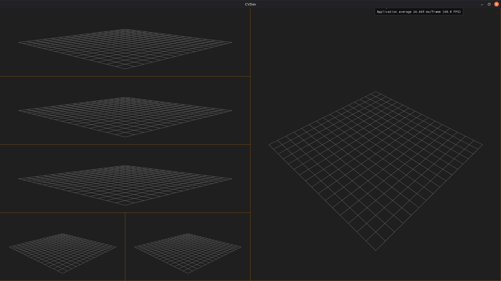

# CVDEV

CVDEV is my personal playground for experimenting with several frameworks related to graphics programming and computer vision. At the moment everything is pretty prototypy, but it is a start.

The vision is currently to make some sort of data visualizer that allows paned windows. Not sure what is will end being, though.

At the moment it looks like this:



## Building

```bash
cmake -S . -B build -DCMAKE_EXPORT_COMPILE_COMMANDS=1
cmake --build build -j16
```

## Running tests

Run all tests with `ctest`:

```bash
ctest --test-dir build/src/test/
```

Or the individual tests in the binary folder (e.g., `build/bin/`).
